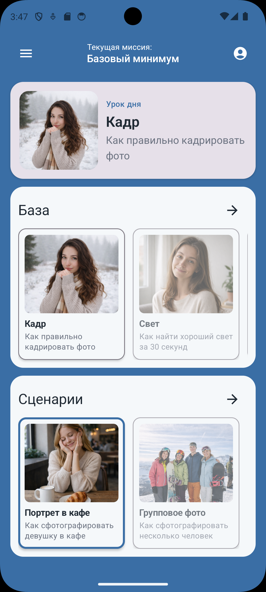
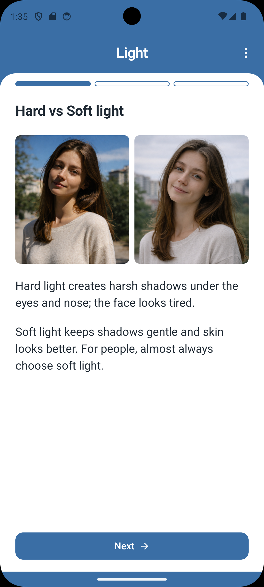

# PhotoMode

**A modular Android app for structured photography lessons — built with Jetpack Compose and a clear separation of UI, domain, and data.**

Each lesson runs as a step-based flow (Theory → Instruction → Practice) with interactive examples and local progress. The codebase is structured for readability and maintainability: single-responsibility use cases, repository abstractions, and state-driven Compose UI.

---

## What this project demonstrates

- **Clean Architecture** — `domain` (models, contracts, use cases), `data` (repos, storage, assets), `app` (Compose, ViewModels, navigation)
- **Modern Android** — Kotlin, Jetpack Compose, Material 3, Navigation Compose
- **State & DI** — Unidirectional data flow, Koin for dependency injection
- **Persistence** — DataStore for progress; lesson content from JSON assets
- **Reusable UI** — Composable step cards (theory, instruction, practice), shared components

---

## Overview

The app teaches photography basics: light, horizon, angle, framing, and real-world scenarios (e.g. cafe portrait, group photo). Users move through steps, see good vs bad examples, and complete lessons; progress is saved locally.

| Home Screen | Lesson Screen |
|-------------|---------------|
|  |  |

_Add `home.png` and `lesson.png` to the `screenshots/` folder to display the images above._

---

## Features

- Step-based lesson engine (Theory / Instruction / Practice)
- Interactive image comparison (tap to reveal labels, auto-dismiss)
- Lesson of the day + categories (Fundamentals, Scenarios)
- Local progress persistence (DataStore)
- Current myassion in the app bar

---

## Architecture

```
PhotoMode/
├── app/        Compose UI, ViewModels, navigation, Koin module
├── data/       Repository implementations, DataStore, LocalLessonStorage, lessons.json
├── domain/     Models, repository interfaces, use cases
└── screenshots/
```

- **domain** — No Android dependencies. Defines `Lesson`, `LessonStep`, repository contracts, and use cases.
- **data** — Implements repositories, parses `lessons.json`, persists progress with DataStore.
- **app** — Compose screens, ViewModels (state + events), single Activity, Koin DI.

UI state is held in ViewModels; composables are stateless and receive data + callbacks. Navigation is type-safe via routes and arguments.

---

## Tech stack

| Layer        | Choice |
|-------------|--------|
| Language    | Kotlin |
| UI          | Jetpack Compose, Material 3 |
| Architecture| Clean Architecture (3 modules) |
| DI          | Koin |
| Navigation  | Navigation Compose |
| Persistence | DataStore (Preferences) |
| Images      | Coil |

---

## Running the project

**Requirements:** Android Studio (latest stable), JDK 11+, minSdk 24.

1. Clone and open:
   ```bash
   git clone https://github.com/<your-username>/PhotoMode.git
   cd PhotoMode
   ```
   Open the project in Android Studio and sync Gradle.

2. Run on a device or emulator (Run → Run 'app').

**Build debug APK from terminal:**

```bash
./gradlew assembleDebug
```

Output: `app/build/outputs/apk/debug/app-debug.apk`. You can upload this to GitHub Releases so others can install without building.

---

## Editing lesson content

Lessons are defined in:

```
data/src/main/assets/lessons.json
```

After changing the file: **Build → Clean Project**, then run the app again so updated assets are loaded.
