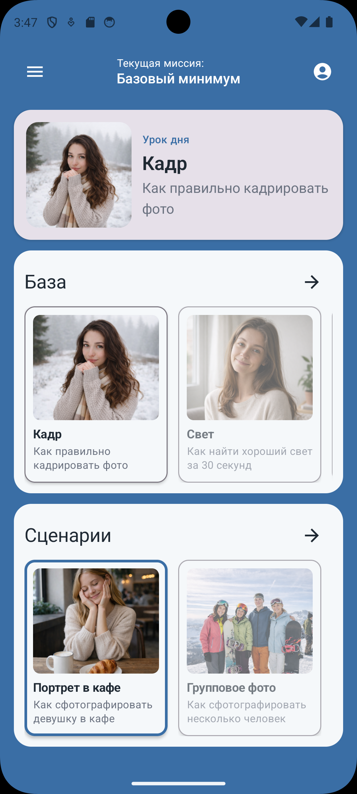
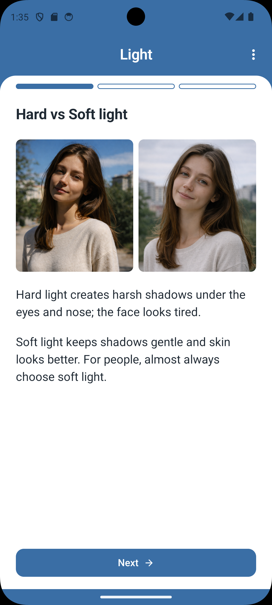

# PhotoMode

[](https://github.com/LisDeNorn/PhotoMode/actions/workflows/ci.yml)

| | app | domain | data |
|---|:---:|:---:|:---:|
| **Coverage** | [](https://codecov.io/gh/LisDeNorn/PhotoMode?flag=app) | [](https://codecov.io/gh/LisDeNorn/PhotoMode?flag=domain) | [](https://codecov.io/gh/LisDeNorn/PhotoMode?flag=data) |

**Kotlin • Jetpack Compose • Clean Architecture • Koin • Room • DataStore**

PhotoMode is a modular Android app built around structured lessons and missions: asset-driven content, mission-aware lists, and local progress, with a Compose UI driven by ViewModels and use cases. The emphasis is on a clear content model and data layer—lessons and missions ship as JSON and can evolve without rewriting presentation logic.

## Screenshots

| Home | Lesson |
|---|---|
|  |  |

## Overview

The app renders lessons from a typed step model (theory, instruction, and related variants) and applies mission and completion state when ordering and highlighting work on the home flow. That keeps navigation and screens stable while content and mission definitions change in assets.

**Static content:** `lessons.json` and `missions.json` are parsed on first use and kept in memory for the app process (no repeated asset I/O on every screen). **User-specific state** is separate: lesson-of-the-day id is stored in DataStore, completed lessons in Room.

Content is intentionally compact: the value shown here is the architecture, persistence boundaries, and how UI consumes immutable state—not the depth of editorial copy.

## Key Features

- **Lesson of the day** — deterministic per-calendar-day choice, persisted so it stays stable until midnight
- **Content model** — fundamentals vs scenario-style categories; steps mapped to composables from data, not hard-coded screens
- **Mission-aware ordering** — home and lists prioritize work tied to the active mission and completion state
- **Visual steps** — theory/instruction steps can show paired reference imagery (see lesson screenshot)
- **Progress** — completed lessons stored locally via Room
- **Profile** — active mission, progress summary, and navigation to the next required lesson

## Architecture

### Modules

```text
app     -> presentation: Compose UI, navigation, ViewModels, DI (Koin)
data    -> repositories, JSON parsing, in-memory parsed catalog (lessons + mission), Room, DataStore
domain  -> models, repository contracts, use cases
```

### Design decisions

- UI state is owned by ViewModels and exposed as immutable state
- Business rules live in use cases instead of screens
- Repository abstractions separate domain logic from data sources
- Lessons and missions are versioned as JSON assets; parsing and mapping stay in the data layer
- Parsed lesson list and current mission are cached in memory after the first read (repositories mirror the same pattern)
- Domain use cases and models avoid Android framework APIs

## Tech Stack

| Layer | Choice |
|---|---|
| Language | Kotlin |
| UI | Jetpack Compose, Material 3 |
| Architecture | Clean Architecture, 3 Gradle modules |
| DI | Koin |
| Navigation | Navigation Compose, centralized route strings |
| Persistence | **Room** — completed lessons · **DataStore Preferences** — lesson-of-the-day id · **In-memory** — parsed `lessons.json` / `missions.json` after first load |
| Images | Coil |
| Testing | JUnit, MockK, coroutines test utilities |

## Testing and CI

- Unit tests are configured for `app`, `domain`, and `data` modules
- GitHub Actions runs tests on push and pull request
- Coverage reports are generated per module and uploaded to Codecov

### Local commands

```bash
./gradlew :app:testDebugUnitTest :domain:testDebugUnitTest :data:testDebugUnitTest
./gradlew :app:createDebugUnitTestCoverageReport :domain:createDebugUnitTestCoverageReport :data:createDebugUnitTestCoverageReport
```

Coverage reports are generated under:

- `app/build/reports/coverage/test/debug/`
- `domain/build/reports/coverage/test/debug/`
- `data/build/reports/coverage/test/debug/`

## Running the project

**Requirements**
- Android Studio
- JDK 11+
- minSdk 24

### Run locally

1. Clone the repository
2. Open the project in Android Studio
3. Sync Gradle
4. Run the `app` configuration on an emulator or device

### Build APK

```bash
./gradlew assembleDebug
```

## Content Configuration

Lesson content is stored in:
- `data/src/main/assets/lessons.json`

Mission configuration is stored in:
- `data/src/main/assets/missions.json`
